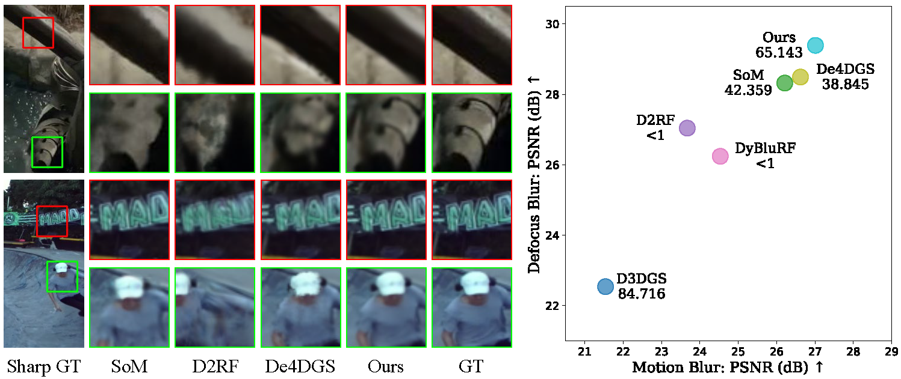
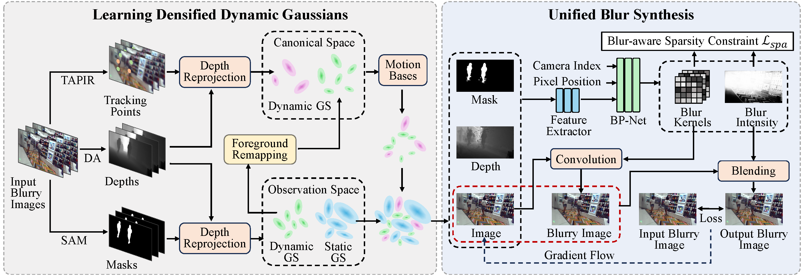

# Dynamic Gaussian Splatting from Defocused and Motion-blurred Monocular Videos (NIPS 2025)

Xuankai Zhang, Junjin Xiao, and Qing Zhang

[Project Page](https://dydeblur.github.io/) &nbsp; [Paper](https://arxiv.org/abs/2510.10691) 

<!-- **05.28**: Our paper is updated with new features (ex. camera motion blur deblurring, more experiments, ...) so please check the new paper at https://arxiv.org/abs/2401.00834.  -->



Our method allows to synthesize high-quality sharp novel views for videos with defocus blur (top) and motion blur (bottom).


## Method Overview


<!-- Our method's overall workflow. Dotted arrows and dashed arrows describe the pipeline for modeling camera motion blur and modeling defocus blur, respectively at training time. Solid arrows show the process of rendering sharp images at the inference time. Please refer to the paper for more details. -->

## Todo
- [x] ~~Release Paper, Example Code~~ 
- [ ] Clean Code

## Setup
###  1. Installation
```
git clone https://github.com/hhhddddddd/dydeblur.git --recursive 
cd dydeblur

conda create -n dydeblur python=3.10
conda activate dydeblur

# install pytorch
conda install pytorch==2.5.0 torchvision==0.20.0 torchaudio==2.5.0 pytorch-cuda=12.4 -c pytorch -c nvidia -y

# install dependencies
pip install -r requirements.txt
```

### 2. Training
```
python train.py -s <dataset> -m <output> -o <expname> -c 0.01 --eval --iterations 40000
```

### 3. Evaluation
```
python render.py -m <output> -o <expname> -c 0.01 -t <time> --mode render 
```

## BibTeX
```
@article{zhang2025dynamic,
  title={Dynamic Gaussian Splatting from Defocused and Motion-blurred Monocular Videos},
  author={Zhang, Xuankai and Xiao, Junjin and Zhang, Qing},
  journal={arXiv preprint arXiv:2510.10691},
  year={2025}
}
```


